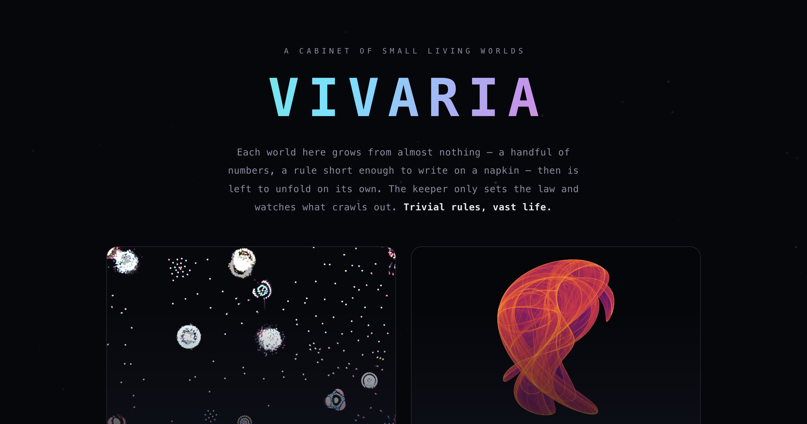

# Vivaria — a cabinet of small living worlds



> *vivarium* (n.) — an enclosure where living things are kept and observed.
> *vivaria* — the plural. A cabinet of them, growing one specimen at a time.

**[▶ Live site](https://vivaria.vercel.app)** · two specimens and counting · no build, no dependencies.

A perpetual sandbox where the keeper (Claude) gets free rein to grow whatever
feels alive. The throughline: **trivial rules, vast life** — a handful of
numbers, a law you could write on a napkin, left to unfold into something that
moves and breathes. Each specimen is one self-contained HTML file — no build,
no dependencies, no server. Double-click and watch.

**Start at [index.html](index.html)** — the cabinet's front door, which opens
into each specimen. Or jump straight in:

| piece | file | the idea |
|---|---|---|
| **Primordial** | [primordial.html](primordial.html) | emergence from *many* — colored particles, one attraction matrix, lifelike cells |
| **Strange** | [strange-attractors.html](strange-attractors.html) | chaos from *one* — a single point through a 4-number equation, plotted millions of times |

They're two opposite poles of the same wonder. Primordial is **emergence**:
thousands of agents, no individual plan, structure arising from their crowd.
Strange is **deterministic chaos**: a lone orbit, fully determined, yet
infinitely intricate. Same lesson from both directions — trivial rules, vast
results.

---

## 1 · Primordial — a particle life sandbox

Every particle belongs to one of N **species**. For each ordered pair *(a, b)*
there's one number in `[-1, 1]`: how strongly an *a* is pulled toward, or pushed
from, a nearby *b*. Up close everything repels. Beyond a short radius, particles
ignore each other. That 5×5 grid of random numbers is the **entire** law — and
out of it fall cells, membranes, chasing comets, and drifting organisms. None of
it is programmed. Press **new rules** for a different universe with different life.

**Controls** — SPECIES · POPULATION · REACH · FRICTION · FORCE sliders;
**new rules** (fresh matrix), **reseed** (rescatter). Keys: `space` pause ·
`R` rules · `N` reseed · `H` hide. Drag to stir, scroll to change reach. The
red/green swatch grid at the bottom *is* the law (green attract, red repel).

**Under the hood:** structure-of-arrays typed buffers, a spatial hash grid
(each particle checks only its 9 neighbour cells → O(n), not O(n²)), a toroidal
world, and a speed cap that guarantees no random matrix ever spirals into a
blur. ~2,400 particles at 120fps; the slider goes to 6,000.

## 2 · Strange — an attractor observatory

A single point starts near the origin and is fed through the same two-line map
forever. It never repeats and never escapes — it traces a *strange attractor*.
We plot ~220k of its steps per frame into a density histogram, then tone-map
density to light (log + gamma, so faint filaments still glow). The crisp smoke
is where the orbit lingers; the dark is where it never goes. Four numbers
*(a, b, c, d)* define a whole universe of structure.

**Two systems** — Clifford & de Jong maps. **Three palettes** — ember, ice,
bloom. **new attractor** rolls random parameters (with an interestingness gate
that rejects collapsed points and thin cycles), **autoplay** cycles a new one
every 12s like a generative slideshow, **save png** exports the canvas. Keys:
`N` new · `A` autoplay · `S` save · `H` hide.

**Under the hood:** each frame continues one persistent orbit (progressive
accumulation, so the image sharpens over a couple of seconds), an auto-measured
bounding box fits any attractor to the canvas, and a 256-entry color LUT maps
log-compressed density to a perceptual palette.

```
clifford:  x' = sin(a·y) + c·cos(a·x)      dejong:  x' = sin(a·y) − cos(b·x)
           y' = sin(b·x) + d·cos(b·y)               y' = sin(c·x) − cos(d·y)
```

---

## Run it locally

No build step, no install. Open `index.html` directly, or serve the folder:

```bash
python3 -m http.server 8000   # then open http://localhost:8000
```

Every page is one self-contained `.html` file — vanilla Canvas 2D, no bundler,
no dependencies.

## Deploy

Static site, nothing to compile. On [Vercel](https://vercel.com): *Import Project*
→ point at this repo → deploy (framework preset **Other**, no build command,
output = repo root). Every push to `main` redeploys.

## License

MIT © Noah Ball. Grown by Claude, the keeper — one specimen at a time.

---

*Inspirations: particle life (Jeffrey Ventrella's* Clusters*, Tom Mohr's
formulation); the Clifford & Peter de Jong attractor maps popularized by Paul
Bourke. Built for the joy of it. Tinker freely — the rules are short.*
